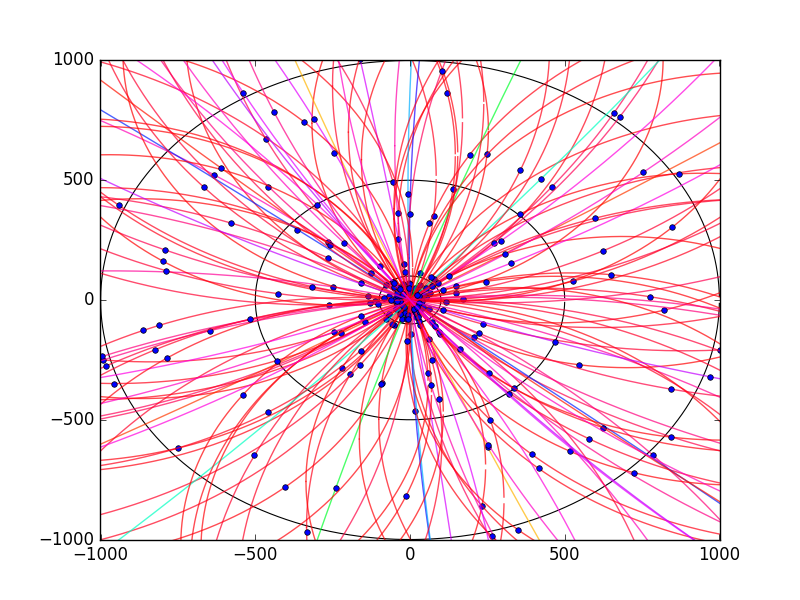

## Work experience @ STFC Rutherford Appleton Laboratory, Harwell

### Some demo output from real data

#### Data sourced from https://gist.githubusercontent.com/StewMH/9f75f8c2915e33b4248ed994173ebc53/raw/03a4f4221a424167beb824ad902768c900a08c50/event via. Kaggle. The data is currently stored locally in the repo, allowing the code to run offline without pulling the data from the Gist.
