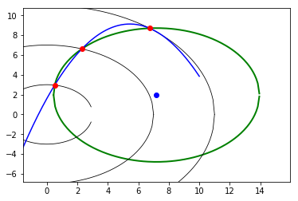
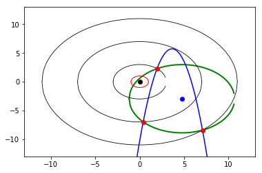
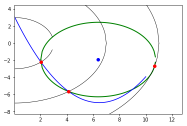
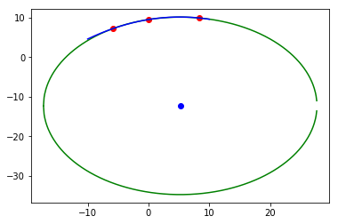
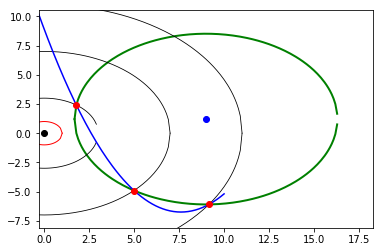

```python
import matplotlib.pyplot as plt
import numpy as np
from math import sqrt, isnan
from random import uniform, randint

def gen_circle_points(rad_0, rad_1, rad_2, num_sets):
        points_list = []

        for i in range(num_sets):
                x0 = uniform(0, rad_0)
                y0 = sqrt(rad_0**2 - x0**2)
                x1 = uniform(0, rad_1)
                y1 = sqrt(rad_1**2 - x1**2)
                x2 = uniform(0, rad_2)
                y2 = sqrt(rad_2**2 - x2**2)

                a  = randint(0,1)
                if a == 1:
                        y0 = -y0

                b  = randint(0,1)
                if b == 1:
                        y1 = -y1

                c  = randint(0,1)
                if c==1:
                        y2 = -y2

                points = [(x0, y0), (x1, y1), (x2, y2)]
                points_list.append(points)

        return points_list

def gen_points(num_sets):

        points_list = []

        for i in range(num_sets):
                point_set = []
                for i in range(6):
                        point_set.append(uniform(-10, 10))
                points_list.append(point_set)

        return points_list
    
def perpline(line, offset):
    x = offset[0] + line[0]/2 #midpoint x
    y = offset[1] + line[1]/2 #midpoint y
    if (line[0] != 0) and (line[1] != 0):
        g = -1 / (line[1] / float(line[0]))
    elif line[0] == 0:
        return 1, 0, y            #perpendicular line is horizontal: 1y = 0x + const
    else: #line[1] == 0
        return 0, 1, x           #perpendicular line is vertical: x = const + 0y --> 0y = x - const
    c = y - (g * x)
    return 1, g, c

def center(points):
    #unpack points
    a, b, c = points

    #find xy deltas of ab and cb
    ab = [a[0] - b[0], a[1] - b[1]]
    cb = [c[0] - b[0], c[1] - b[1]]

    #find perpendicular line from ab
    y, g1, c1 = perpline(ab, b)

    #find perpendicular line from cb
    y, g2, c2 = perpline(cb, b)

    #form and solve simultaneous equations
    #print("y = {}x + {}".format(g1, c1))
    #print("y = {}x + {}".format(g2, c2))
    A = np.array([[y,-g1],[y,-g2]])      #y = 0x + c
    B = np.array([c1, c2])
    try:
        C = np.linalg.solve(A,B)
    except:
        print("[INFO] No reasonable solution, or one or more linear equations were parallel to an axis.\n       Please use a different tracing method (parabola).")
        return "N/A", "N/A"
    #return solution
    if (isnan(C[0]) or isnan(C[1])): return "N/A", "N/A"
    y, x = C[0], C[1]
    return x, y

def plot_circle(r, cx, cy, color):
    xs = []; ys = []
    x = -r
    while x <= r:
       y = sqrt(r ** 2 - x ** 2)
       xs.append(x+cx); ys.append(y+cy);
       x += 0.1
    plt.plot(xs, ys, color=color)
    ys = [2*cy - y for y in ys]
    plt.plot(xs, ys, color=color)

def plot(points, cen, r, a, b, c, radii):
    if (r != "N/A"):
        plt.xlim(cen[0] - r-2, cen[0] + r + 2) #circle plus padding
        plt.ylim(cen[1] - r-2, cen[1] + r + 2) #circle plus padding
        plt.autoscale(False)
        
    
    #plot points
    plt.plot([x for x, y in points],
             [y for x, y in points], 'ro', color="red")
    
    #plot circle and center
    if (r != "N/A"):
        plt.plot([cen[0]], [cen[1]], 'ro', color="blue")
        plot_circle(r, cen[0], cen[1], "green")
        
    for r in radii:
        plot_circle(r, 0, 0, "black")
        
    plot_quadratic(a, b, c)
    
    plt.show()
    return

def circle(points):
    c = center(points)
    if c[0] == "N/A": return c #returns 2 x "N/A"
    r = sqrt((points[0][0] - c[0])**2 +
                  (points[0][1] - c[1])**2)
    return c, r

def quadratic(points):
        x0, y0 = points[0]
        x1, y1 = points[1]
        x2, y2 = points[2]

        x_2_coeff = ((y1-y2)*(x0-x1)-(y0-y1)*(x1-x2))/((x1**2 - x2**2)*(x0-x1) - (x0**2-x1**2)*(x1-x2))
        x_coeff = ((y1-y2)*(x0**2-x1**2)-(y0-y1)*(x1**2-x2**2))/((x0**2-x1**2)*(x1-x2)-(x1**2-x2**2)*(x0-x1))
        coeff_1   = x0*x1*y2/((-x0 + x2)*(-x1 + x2)) + x0*x2*y1/((-x0 + x1)*(x1 - x2)) + x1*x2*y0/((x0 - x1)*(x0 - x2))
        return x_2_coeff, x_coeff, coeff_1

def plot_quadratic(a,b,c):
    xs = []; ys = []
    x = -10
    while x <= 10:
        y = a * (x ** 2) + b * x + c
        xs.append(x); ys.append(y);
        x += 0.1
    plt.plot(xs, ys, color="blue")
    return

if __name__ == "__main__":
    r_1, r_2, r_3 = 2, 7, 10
    for i in range(5): #how many to show (in series)
        points = gen_circle_points(r_1,r_2,r_3,1)[0]
        print("Points: "+str(points))
        cen, r = circle(points)
        print("Center: "+str(cen))
        print("Radius: "+str(r))
        a, b, c = quadratic(points)
        print("Quadratic: {}x^2+{}x+{}".format(a,b,c))
        plot(points, cen, r, a, b, c, (r_1, r_2, r_3))
        print("="*40)

```

    Points: [(0.12941955705908725, -1.9958082518745706), (4.080168541318717, 5.6879016055513025), (0.3473730263614283, -9.993964777832494)]
    Center: (16.49295218198515, -5.551942339310543)
    Radius: 16.74548564882021
    Quadratic: 10.35189260410158x^2+-41.6323296798235x+3.2188411994958024





    ========================================
    Points: [(1.6433011747171966, -1.139983003896585), (1.9365257964286404, -6.726802200136884), (1.0359656146589336, 9.946194008023589)]
    Center: (-3636.5636450601446, -194.89265016578454)
    Radius: 3643.3624414356505
    Quadratic: -0.8874961521875869x^2+-15.875953073941808x+27.34561833284421





    ========================================
    Points: [(0.9244768569389681, -1.7735113591359506), (1.031138027428899, -6.923637365459722), (5.92319902678863, -8.0570288127231)]
    Center: (4.2206099401954384, -4.281414624908717)
    Radius: 4.141747468522376
    Quadratic: 9.613104687854062x^2+-67.08444988230781x+52.02859839176591





    ========================================
    Points: [(0.5005276048645946, -1.9363553694424256), (3.589592491281918, -6.009561194174869), (9.959920837789113, 0.8944142803948378)]
    Center: (5.483003932441068, -1.3656675649513952)
    Radius: 5.015052833725158
    Quadratic: 0.25396548259908575x^2+-2.3573379502765337x+-0.8200680861035121





    ========================================
    Points: [(0.4842263448002606, -1.9404960311738284), (1.0937498106269727, 6.914022805267095), (0.5520273534753994, 9.984751664463916)]
    Center: (-23.49881013674431, 4.158676137861525)
    Radius: 24.74643287471213
    Quadratic: -297.8629316524044x^2+484.5475568906118x+-166.72973191439578





    ========================================

