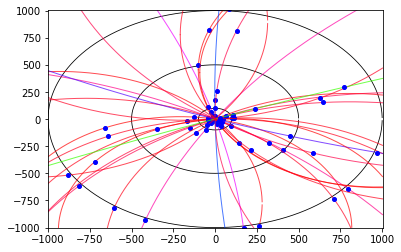

### This file ran with a reduced set of points due to the available Python Environment and Jupyter kernel limitations.
### See the README for further demos.

```python
import matplotlib.pyplot as plt
from matplotlib.colors import hsv_to_rgb
import numpy as np
from math import sqrt, isnan, atan, degrees
from random import uniform, randint

## Artificial data generation

def gen_circle_points(radii, num_sets):
        points_list = []

        for i in range(num_sets):
            points = []
            
            for r in radii:
                a = randint(0,1)
                x = uniform(-r,r)
                y = sqrt(r**2 - x**2)
                if a == 0: y = -y
                points.append((x,y))
                
            points_list.append(points)
        return points_list


def gen_lots(radii, num_sets):
    points_r1 = []
    points_r2 = []
    points_r3 = []
    
    r1 = radii[0]
    r2 = radii[1]
    r3 = radii[2]
    
    for i in range(num_sets):
        a = randint(0,1)
        x = uniform(-r1,r1)
        y = sqrt(r1**2 - x**2)
        if a == 0: y = -y
        points_r1.append((x,y))
        
    for i in range(num_sets):
        a = randint(0,1)
        x = uniform(-r2,r2)
        y = sqrt(r2**2 - x**2)
        if a == 0: y = -y
        points_r2.append((x,y))
        
    for i in range(num_sets):
        a = randint(0,1)
        x = uniform(-r3,r3)
        y = sqrt(r3**2 - x**2)
        if a == 0: y = -y
        points_r3.append((x,y))
        
    return points_r1, points_r2, points_r3

def combinations(points):
    combo_list = []
    points_r1, points_r2, points_r3 = points
    
    for i in points_r1:
        for n in points_r2:
            for m in points_r3:
                point_set = [i, n, m]
                combo_list.append(point_set)
    return combo_list

##Data processing

def stayswithin(a,b,c, r):
    x = -b/(2*a)
    y = a*x**2 + b*x + c
    return (x**2 + y**2) <= r**2

def perpline(line, offset):
    x = offset[0] + line[0]/2 #midpoint x
    y = offset[1] + line[1]/2 #midpoint y
    if (line[0] != 0) and (line[1] != 0):
        g = -1 / (line[1] / float(line[0]))
    elif line[0] == 0:
        return 1, 0, y            #perpendicular line is horizontal: 1y = 0x + const
    else: #line[1] == 0
        return 0, 1, x           #perpendicular line is vertical: x = const + 0y --> 0y = x - const
    c = y - (g * x)
    return 1, g, c

def center(points):
    #unpack points
    a, b, c = points

    #find xy deltas of ab and cb
    ab = [a[0] - b[0], a[1] - b[1]]
    cb = [c[0] - b[0], c[1] - b[1]]

    #find perpendicular line from ab
    y, g1, c1 = perpline(ab, b)

    #find perpendicular line from cb
    y, g2, c2 = perpline(cb, b)

    #form and solve simultaneous equations
    A = np.array([[y,-g1],[y,-g2]])
    B = np.array([c1, c2])
    try:
        C = np.linalg.solve(A,B)
    except:
        print("[WARN] Lines do not converge, no real solution by this method.\n       Please use a different tracing method (parabola).")
        return "N/A", "N/A"
    #return solution
    if (isnan(C[0]) or isnan(C[1])): return "N/A", "N/A"
    y, x = C[0], C[1]
    return x, y

def circle(points):
    c = center(points)
    if c[0] == "N/A": return c #returns 2 x "N/A"
    r = sqrt((points[0][0] - c[0])**2 +
                  (points[0][1] - c[1])**2)
    return c, r

def quadratic(points):
        x0, y0 = points[0]
        x1, y1 = points[1]
        x2, y2 = points[2]
        
        try:
            x_2_coeff = ((y1-y2)*(x0-x1)-(y0-y1)*(x1-x2))/((x1**2 - x2**2)*(x0-x1) - (x0**2-x1**2)*(x1-x2))
            x_coeff = ((y1-y2)*(x0**2-x1**2)-(y0-y1)*(x1**2-x2**2))/((x0**2-x1**2)*(x1-x2)-(x1**2-x2**2)*(x0-x1))
            coeff_1   = x0*x1*y2/((-x0 + x2)*(-x1 + x2)) + x0*x2*y1/((-x0 + x1)*(x1 - x2)) + x1*x2*y0/((x0 - x1)*(x0 - x2))
            return [x_2_coeff, x_coeff, coeff_1]
        except:
            return [0,0,0]

def quad_near_origin(coeffs, tolerance):
        t = tolerance
        x = -t
        a, b, c = coeffs[0], coeffs[1], coeffs[2]
        while x <= t:
            y = a*x**2 + b*x + c
            if sqrt(x**2+y**2) <= t: return True
            x += 0.025
        return False
    
def circle_near_origin(radius, centre, tolerance):
        a = centre[0]
        b = centre[1]

        dist = sqrt(a**2 + b**2)
        return (abs(dist - radius) <= tolerance)

def angle(point):
    if point[0] > 0: #right quadrants
        if point[1] > 0: #top right
            return degrees(atan(point[0]/point[1]))
        elif point[1] < 0: #bottom right
            return 180 + degrees(atan(point[0]/point[1]))
        return 90
    elif point[0] < 0: #left quadrants
        if point[1] > 0: #top left
            return 360 + degrees(atan(point[0]/point[1]))
        elif point[1] < 0:         #bottom left
            return 180 + degrees(atan(point[0]/point[1]))
        return 270
    if point[1] > 0: return 0
    return 180

def sector(ps):
    angles = []
    for point in ps:
        angles.append(angle(point))
    angles = sorted(angles)
    sector = angles[-1] - angles[0]
    return sector    

def minsector(points):
    s = [sector(points)] 
    #switch points locally to find minimum sector
    npoints = []
    for p in points:
        npoints.append((p[1],p[0]))
    s.append(sector(npoints))
    return sorted(s)[0]

#Data plotting

def plot_circle(r, cx, cy, color, lw=2, alpha=1):
    xs = []; ys = []
    x = -r
    while x <= r:
       y = sqrt(r ** 2 - x ** 2)
       xs.append(x+cx); ys.append(y+cy);
       x += 0.1
    plt.plot(xs, ys, color=color, linewidth=lw, alpha = alpha)
    ys = [2*cy - y for y in ys]
    plt.plot(xs, ys, color=color, linewidth=lw, alpha = alpha) 
    return

def plot_quadratic(a,b,c,clip):
    xs = []; ys = []
    x = -clip
    while x <= clip:
        y = (a * (x ** 2)) + (b * x) + c
        xs.append(x); ys.append(y);
        x += 0.1
    plt.plot(xs, ys, color="blue", linewidth=1)
    return

def plot_setup(radii, tolerance):
    plt.xlim(-radii[-1] -2, radii[-1] +2) #2 units padding
    plt.ylim(-radii[-1] -2, radii[-1] +2)
    plt.autoscale(False)
    
    #plot 'detector' rings
    for r in radii:
        plot_circle(r, 0, 0, "black", lw=0.8)
    
    #plot tolerance
    plot_circle(tolerance, 0, 0, "red", lw= 1)
    
    #plot origin
    plt.plot([0],[0], 'ro', color="black")
    return

def plot(points, acc, tolerance,road,clip): #points and feedback accuracy for rounding output
    cen, r = circle(points)
    a, b, c = quadratic(points)
    
    road = road #maximum sector size between points
    
    circ=q= False
    #plot circle and center
    if (r != "N/A"):
        if (circle_near_origin(r, cen, tolerance) and minsector(points) < road and
           r > 1000):
            #plt.plot([cen[0]], [cen[1]], 'ro', color="green")
            color = hsv_to_rgb([1-(((r-1000)/30000.)%1), 1, 1])
            plot_circle(r, cen[0], cen[1], color, lw=1, alpha=0.7)
            print("Circle plotted: TRUE")
            print("Center: ({},{})".format(round(cen[0],acc),round(cen[1],acc)))
            print("Radius: "+str(round(r,acc)))
            circ = True
    
    #plot the quadratic
    '''if a != 0 and (quad_near_origin([a,b,c], tolerance) and minsector(points) < road and 
        stayswithin(a,b,c,radii[-1])):
        plot_quadratic(a, b, c,clip)
        print("Quadratic plotted: TRUE")
        print("Quadratic: {}x^2+{}x+{}".format(round(a,acc),round(b,acc),round(c,acc)))
        q = True'''
    
    #plot points
    if q or circ:
        plt.plot([x for x, y in points],
                 [y for x, y in points], 'ro', color="blue", markersize=4)
    return circ, q

#Real data retrieval

def realdataxy(sets):
    import urllib.request
    with urllib.request.urlopen('https://gist.githubusercontent.com/StewMH/9f75f8c2915e33b4248ed994173ebc53/raw/03a4f4221a424167beb824ad902768c900a08c50/event') as response:
        code = response.read().decode().split("\n")[1:]
    layers = {}
    for i in range(2,15):
        layers[i] = []
    for line in code:
        try:
            l = line.split(",")
            x, y = float(l[1]), float(l[2])
            layer = int(l[5])
            point = (x,y)
            layers[layer].append(point)
        except:
            continue
    combos = []
    points = []
    for i in range(2, 15):
        points += layers[i]
    for i in range(sets):
        #select three random points
        combo = [points[randint(0,len(points)-1)] for j in range(3)]
        combos.append(combo)
    return combos

if __name__ == "__main__":
    print("="*40)
    radii = (100, 500, 1000)
    tolerance = 1
    road = 70
    acc = 2 #accuracy of output
    num_sets = 100000
    plot_setup(radii, tolerance)
    #combos = combinations(gen_lots(radii, num_sets))
    combos = realdataxy(num_sets)
    circles=quadratics=[] #empty sets for reasonable paths
    for combo in combos:
        c, q = plot(combo, acc, tolerance,road,radii[-1])
        if c or q: 
            print("Points: "+str([(round(p[0], acc), round(p[1],acc)) for p in combo]))
            print("="*50)
        if c: circles.append(c) #good circle combo
        if q: quadratics.append(q) #good quadratic combo
    print("Tolerance: {}".format(tolerance))
plt.show() #unindented to show all plots on one graph
```

    ========================================
    Circle plotted: TRUE
    Center: (-210.23,-1006.23)
    Radius: 1028.42
    Points: [(-656.79, -79.82), (-45.28, 8.88), (-129.02, 18.98)]
    ==================================================
    Circle plotted: TRUE
    Center: (50.92,-1579.12)
    Radius: 1579.99
    Points: [(-170.69, -14.75), (-642.05, -159.21), (-31.56, -1.28)]
    ==================================================
    Circle plotted: TRUE
    Center: (1079.31,-2272.8)
    Radius: 2516.17
    Points: [(-152.4, -78.72), (-28.53, -13.64), (-815.41, -617.16)]
    ==================================================
    Circle plotted: TRUE
    Center: (-1880.88,-3153.6)
    Radius: 3671.19
    Points: [(409.22, -284.28), (29.05, -18.36), (795.96, -641.22)]
    ==================================================
    Circle plotted: TRUE
    Center: (3591.48,-2171.42)
    Radius: 4196.41
    Points: [(-417.48, -931.22), (-22.88, -39.23), (-56.58, -97.41)]
    ==================================================
    Circle plotted: TRUE
    Center: (-6106.95,-1548.33)
    Radius: 6300.37
    Points: [(170.21, -1007.98), (7.88, -30.55), (12.04, -47.4)]
    ==================================================
    [WARN] Lines do not converge, no real solution by this method.
           Please use a different tracing method (parabola).
    Circle plotted: TRUE
    Center: (986.09,454.83)
    Radius: 1086.76
    Points: [(-13.59, 28.56), (-37.41, 820.21), (-99.94, 494.79)]
    ==================================================
    Circle plotted: TRUE
    Center: (12290.4,219.71)
    Radius: 12292.61
    Points: [(-0.78, 32.03), (-2.12, 171.45), (23.92, 1020.8)]
    ==================================================
    Circle plotted: TRUE
    Center: (-182.82,1689.87)
    Radius: 1700.7
    Points: [(625.61, 193.6), (41.99, 4.09), (101.26, 13.06)]
    ==================================================
    Circle plotted: TRUE
    Center: (962.87,428.53)
    Radius: 1054.52
    Points: [(84.43, 1011.95), (-27.26, 65.67), (-41.5, 107.17)]
    ==================================================
    Circle plotted: TRUE
    Center: (-933.87,-776.46)
    Radius: 1215.49
    Points: [(144.84, -216.28), (20.86, -24.19), (263.46, -985.77)]
    ==================================================
    Circle plotted: TRUE
    Center: (1426.32,1962.74)
    Radius: 2425.66
    Points: [(37.26, -25.8), (95.31, -65.12), (586.99, -313.07)]
    ==================================================
    Circle plotted: TRUE
    Center: (181.58,-1444.43)
    Radius: 1455.72
    Points: [(115.48, 9.78), (45.36, 4.9), (36.13, 4.0)]
    ==================================================
    Circle plotted: TRUE
    Center: (797.01,-1222.06)
    Radius: 1458.28
    Points: [(-604.88, -820.49), (-25.92, -18.17), (-36.92, -25.76)]
    ==================================================
    Circle plotted: TRUE
    Center: (-769.22,-1452.87)
    Radius: 1644.36
    Points: [(708.85, -732.3), (323.71, -224.29), (42.09, -22.59)]
    ==================================================
    Circle plotted: TRUE
    Center: (3330.7,8812.35)
    Radius: 9420.66
    Points: [(30.06, -11.18), (448.42, -156.56), (971.26, -308.06)]
    ==================================================
    Circle plotted: TRUE
    Center: (807.31,-1966.79)
    Radius: 2125.86
    Points: [(66.37, 25.77), (645.44, 152.9), (109.48, 41.28)]
    ==================================================
    Circle plotted: TRUE
    Center: (96.05,-1028.75)
    Radius: 1034.13
    Points: [(-345.24, -93.5), (-718.79, -392.0), (-42.88, -4.0)]
    ==================================================
    Circle plotted: TRUE
    Center: (8217.45,-20503.3)
    Radius: 22089.57
    Points: [(239.71, 95.36), (770.72, 293.23), (29.4, 12.67)]
    ==================================================
    Circle plotted: TRUE
    Center: (1342.17,777.73)
    Radius: 1550.89
    Points: [(16.86, -27.76), (215.68, -288.23), (37.42, -60.65)]
    ==================================================
    Circle plotted: TRUE
    Center: (2429.95,33.52)
    Radius: 2430.51
    Points: [(0.34, 99.61), (128.53, 815.08), (10.03, 260.09)]
    ==================================================
    Circle plotted: TRUE
    Center: (-1119.66,896.98)
    Radius: 1434.05
    Points: [(-115.91, -127.22), (-883.23, -517.44), (-47.19, -55.02)]
    ==================================================
    Tolerance: 1




